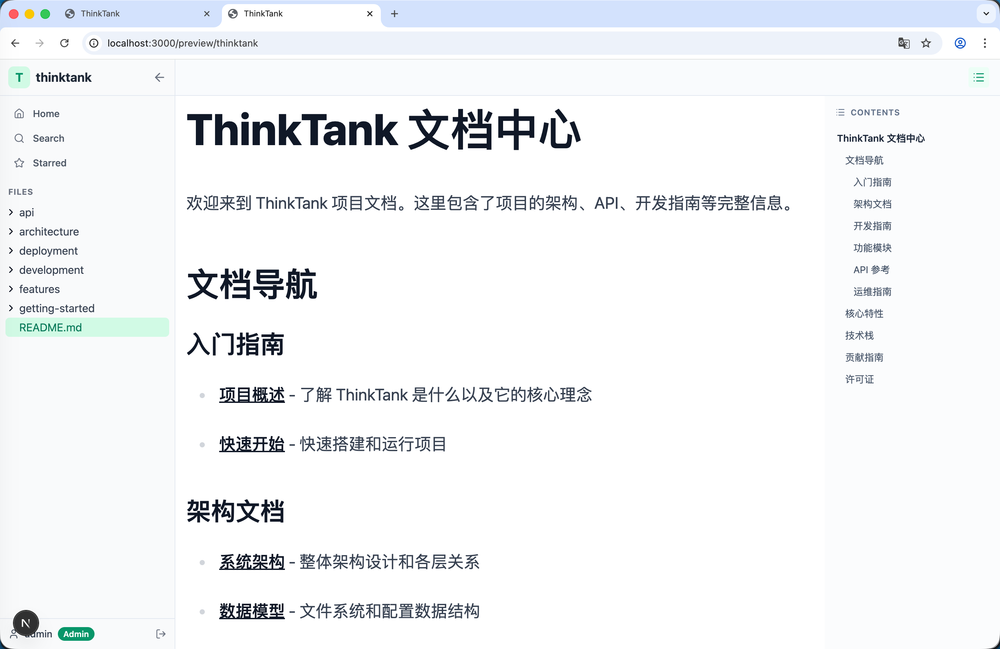
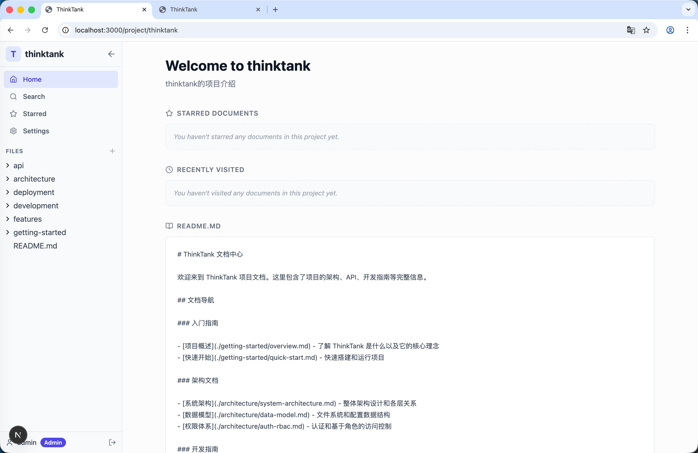
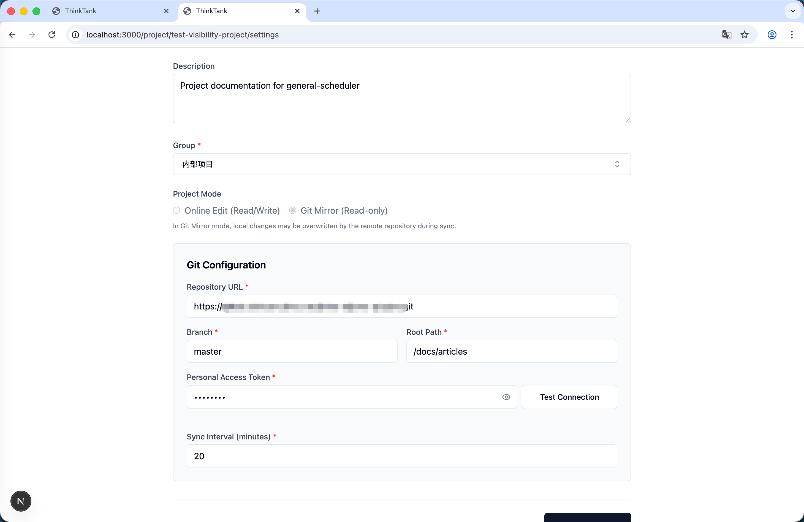
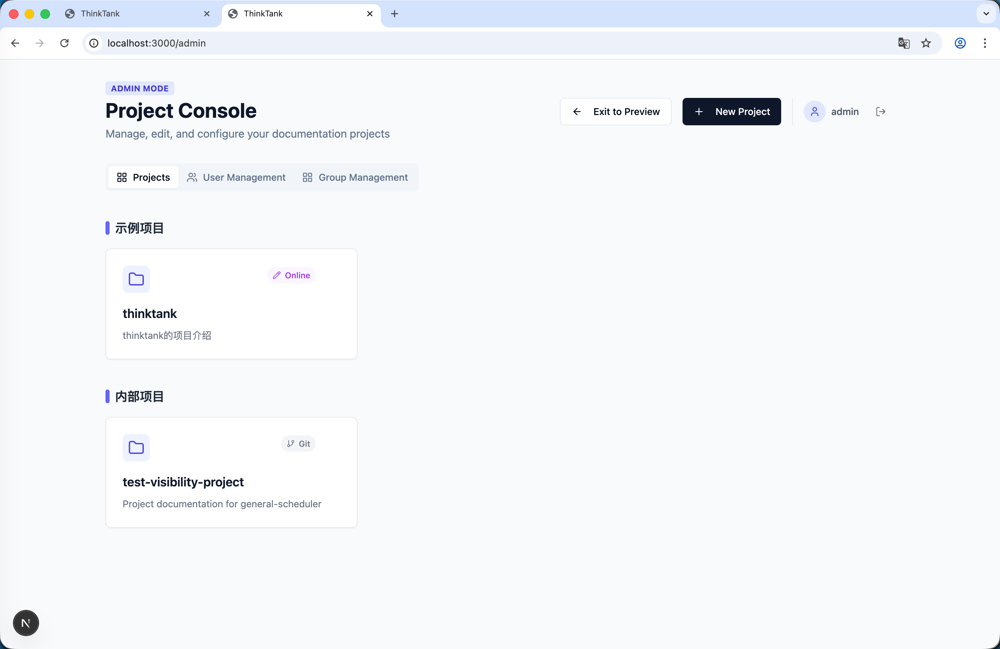
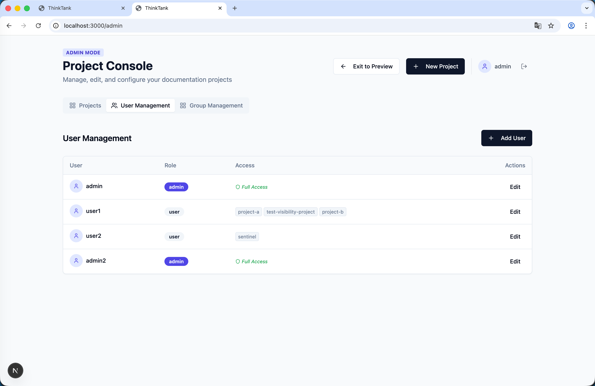
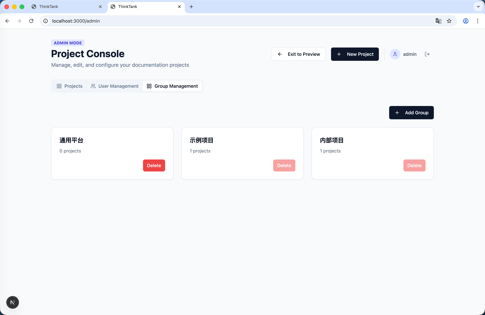
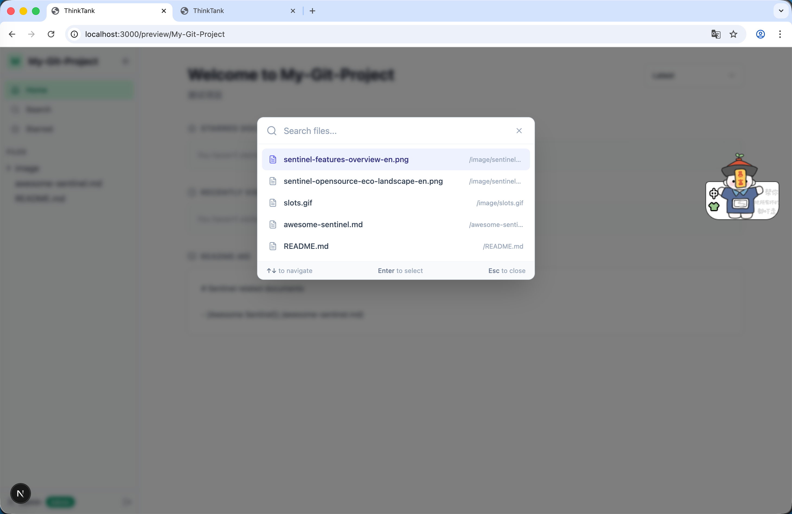
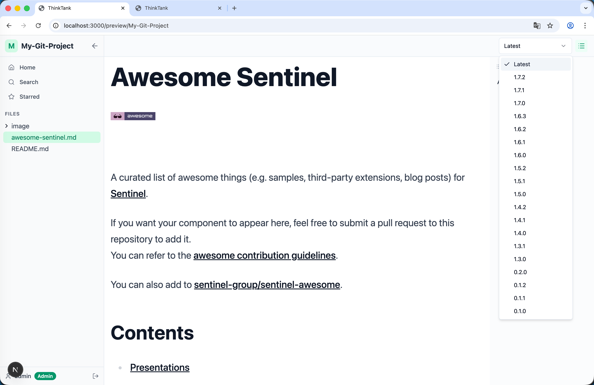
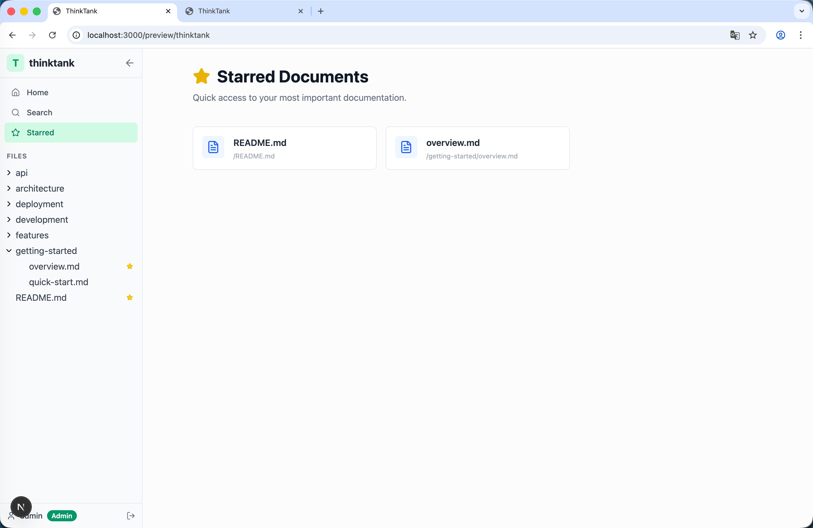

# ThinkTank - 文档管理系统

ThinkTank 是一个基于 Next.js 构建的现代化、基于文件的文档管理系统。它支持多项目独立管理、富文本 Markdown 编辑、Git 仓库集成，并提供了完善的用户权限控制体系。

## 系统截图

<div style="display: grid; grid-template-columns: repeat(2, 1fr); gap: 10px;">
  
  
  
  
  
  
  
  
  
</div>

## 主要特性

-   **多项目管理**：独立管理多个文档项目，支持项目隔离。
-   **强大的 Markdown 编辑器**：基于 [TipTap](https://tiptap.dev/) 构建，支持：
    -   标准 Markdown 语法
    -   代码块语法高亮
    -   表格、图片、链接
    -   所见即所得 (WYSIWYG) 与 源码模式切换
    -   分屏实时预览
-   **Git 集成**：支持将项目关联到远程 Git 仓库，实现文档的版本同步。
-   **角色权限控制 (RBAC)**：
    -   **管理员 (Admin)**：拥有最高权限，可管理所有项目、用户及系统设置。
    -   **普通用户 (User)**：仅可访问被分配的项目。
    -   **访客 (Guest)**：默认可公开浏览所有项目（可配置）。
-   **用户管理**：内置管理员后台，支持创建用户、重置密码、分配项目权限。
-   **本地文件存储**：所有数据（文档和配置）默认存储在本地文件系统 (`./docs`)，便于备份和迁移。

## 技术栈

-   **框架**: [Next.js 16](https://nextjs.org/) (App Router)
-   **语言**: [TypeScript](https://www.typescriptlang.org/)
-   **样式**: [Tailwind CSS](https://tailwindcss.com/) & [Shadcn UI](https://ui.shadcn.com/)
-   **认证**: [NextAuth.js](https://next-auth.js.org/)
-   **编辑器**: [TipTap](https://tiptap.dev/)
-   **Git 操作**: [simple-git](https://github.com/steveukx/git-js)
-   **图标**: [Lucide React](https://lucide.dev/)

## 快速开始

### 环境要求

-   Node.js (建议 v18 或更高版本)
-   npm, yarn, 或 pnpm

### 安装步骤

1.  克隆仓库：
    ```bash
    git clone <your-repo-url>
    cd <your-project-directory>
    ```

2.  安装依赖：
    ```bash
    npm install
    # 或者
    yarn install
    ```

3.  配置环境变量：
    在项目根目录创建一个 `.env.local` 文件。可以使用以下模板：

    ```env
    # NextAuth 配置 (必填)
    NEXTAUTH_URL=http://localhost:3000
    NEXTAUTH_SECRET=your-super-secret-key-change-me

    # 可选: OAuth 提供商 (如需开启第三方登录)
    GITHUB_ID=
    GITHUB_SECRET=
    GOOGLE_CLIENT_ID=
    GOOGLE_CLIENT_SECRET=

    # 系统配置
    # DOCS_ROOT=./docs  # 文档存储根目录，默认为 ./docs
    ENCRYPTION_KEY=your-32-char-encryption-key-for-secure-storage # 用于加密敏感信息
    ```

4.  启动开发服务器：
    ```bash
    npm run dev
    ```

5.  在浏览器中打开 [http://localhost:3000](http://localhost:3000)。

### 初始设置

首次启动系统时，如果没有任何用户，系统会自动创建一个默认管理员账户。

-   **默认管理员账号**：
    -   **用户名**: `admin`
    -   **密码**: `123`

**重要提示**: 请在首次登录后立即修改默认密码以确保安全。

## 用户指南

### 管理员控制台
访问 `/admin` (或点击顶部的 "Manage Projects" 按钮)。
-   **项目管理 (Projects)**：创建新项目、配置 Git 仓库地址、编辑项目描述。
-   **用户管理 (User Management)**：添加新用户、重置密码、为用户分配特定项目的访问权限。

### 项目模式
-   **在线编辑模式 (Edit Mode)**：直接在本地 `docs/` 目录中编辑文件。适合个人使用或内部网络环境。
-   **Git 模式 (Git Mode)**：将项目连接到远程 Git 仓库。系统可以拉取远程更改并同步内容（需配置 SSH 或 HTTPS 凭证）。

## 项目结构

```
├── app/                # Next.js App Router 页面和 API 路由
├── components/         # React 组件 (UI, 编辑器等)
├── lib/                # 核心逻辑 (认证, 文件系统, Git, 用户服务)
├── docs/               # 文档项目的默认存储位置
│   ├── .thinktank/     # 系统配置和用户数据
│   └── <project-id>/   # 单个项目文件夹
├── public/             # 静态资源 (图片等)
└── types/              # TypeScript 类型定义
```

## 许可证

[ISC](LICENSE)
