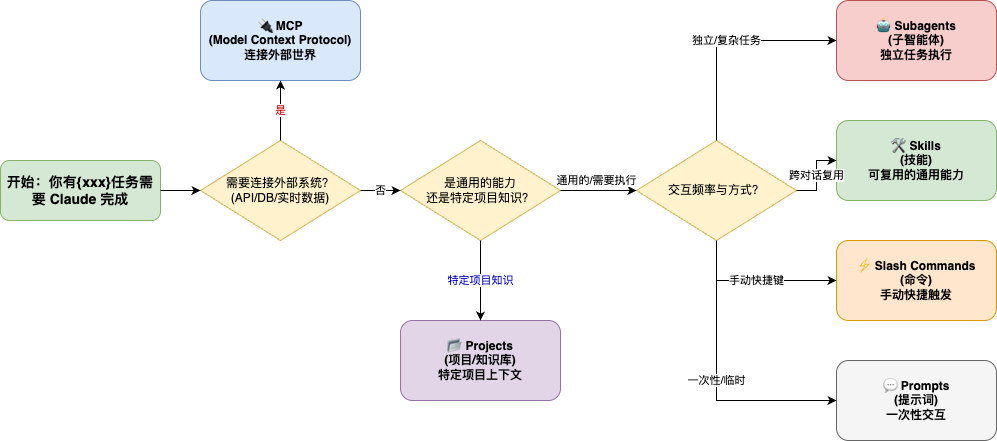

# Claude 生态系统工具最佳实践指引

本文档基于 [Claude 对 skills-explained 文章](https://claude.com/blog/skills-explained) 整理，旨在帮助开发者理清 **Skills**、**MCP**、**Subagents**、**Slash Commands**、**Projects** 和 **Prompts** 的概念、区别及最佳使用场景。

---

## 1. 核心概念概览

> **🏠 通俗版理解**
>
> 如果把开发工作比作管理一个庄园，那么：
>
> *   **Claude Code (大管家)**：统筹一切，直接听命于你，是你唯一的对话接口。
> *   **Projects (不同的别墅)**：这一栋是“电商别墅”，那一栋是“AI别墅”。管家走进哪栋别墅，就熟悉哪里的布局（上下文）。别墅里的家具（Project Context）带不走。
> *   **Skills (专业技能手册)**：比如《米其林烹饪指南》或《水管维修手册》。管家学会了（加载 Skill），在任何别墅里都能用这些技能做饭或修水管。
> *   **Subagents (特聘专员)**：比如“园丁”或“审计员”。管家觉得活儿太专或需要避嫌（权限隔离），就包给他们做。他们只在特定区域活动。
> *   **Slash Commands (传唤铃/快捷按钮)**：你手边的一排按钮。按一下 `🔔 /clean`，管家就知道要立刻打扫。是你**主动**发起的快捷指令。
> *   **MCP (外包服务/市政管道)**：自来水管（数据库连接）、电话线（API）。管家并不自己造水，但他可以通过拧开水龙头（调用 MCP Tool）来获取水。
>
> ---

在 Claude 的开发生态中，我们有六种主要的工具形式，它们各自解决不同的问题：

### 🛠️ Skills (技能)
*   **定义**：包含指令、脚本和资源的专用文件夹，Claude 可动态发现并按需加载。
*   **核心特征**：**可复用**、**可移植**、**版本控制**。
*   **架构**：采用“渐进式披露”，先扫描元数据（低 Token 消耗），仅在需要时加载完整指令和资源。
*   **适用场景**：跨对话复用的程序化知识、标准操作流程 (SOP)、特定领域的专家能力。

### 🔌 MCP (Model Context Protocol)
*   **定义**：连接 Claude 到外部数据源和 API 的开放标准协议。
*   **核心特征**：**实时连接**、**外部集成**。
*   **架构**：需要独立的 MCP 服务器，通过 JSON-RPC 通信。
*   **适用场景**：访问数据库、调用外部 API、获取实时数据（如需求、任务）。

### 🤖 Subagents (子智能体)
*   **定义**：为特定目的设计的独立、自包含智能体。
*   **核心特征**：**自主性**、**受限权限**、**独立工作流**。
*   **架构**：拥有独立的工具集和权限范围，可以与其他代理协作。
*   **适用场景**：需要独立执行且有特定权限限制的任务（如“Web 应用测试员”）。

### ⚡ Slash Commands (命令)
*   **定义**：Claude Code CLI 提供的以 `/` 开头的指令。
*   **类型**：
    *   **内置指令**：系统控制（如 `/clear` 清空上下文, `/cost` 查看费用, `/init` 初始化）。
    *   **自定义指令**：用户定义的 Prompt 快捷方式（保存为 `.md` 文件）。
    *   **MCP 指令**：由 MCP 服务暴露的 Prompt。
*   **核心特征**：**快捷触发**、**人工控制**、**CLI 交互**。
*   **适用场景**：你经常手动输入的指令，希望通过 `/shortcut` 快速触发。

### 📂 Projects (项目/知识库)
*   **定义**：Claude Code 工作区内的持久化背景知识。
*   **核心特征**：**上下文常驻**、**工作区绑定**、**不可移植**。
*   **适用场景**：特定项目的 API 文档、代码库架构说明、不需要跨项目复用的知识。

### 💬 Prompts (提示词)
*   **定义**：一次性、对话式的指令，通常用于单次交互。
*   **核心特征**：**即时性**、**低成本**、**非结构化**。
*   **适用场景**：无需配置的临时任务、简单的问答、一次性代码生成。

---

## 2. 概念流程图

---

## 3. 决策矩阵：如何选择？

如果不确定该使用哪种工具，请参考以下决策流：

| 你的需求是... | 推荐工具 | 关键词 |
| :--- | :--- | :--- |
| **跨对话重复使用**相同的指令或流程 | **Skills** | 复用、程序化知识 |
| 需要**连接外部系统**（数据库/API） | **MCP** | 集成、实时数据 |
| 需要**独立执行**复杂任务且权限受限 | **Subagents** | 自主、隔离 |
| **手动快捷触发**常用指令 | **Slash Commands** | 快捷、CLI 控制 |
| 只是**一次性**的临时交互 | **Prompts** | 即时、对话 |
| 需要**特定工作区**的背景知识 | **Projects** | 上下文、持久化 |

> **💡 核心洞察：升级你的工具箱**
>
> *   **重复输入**相同的 Prompt？ -> 封装为 **Skill**（让 Agent 学会）。
> *   **频繁手动**敲同一个指令？ -> 定义为 **Slash Command**（给自己个快捷键）。
> *   **依赖特定**项目文档？ -> 放入 **Project**（作为背景知识）。
> *   **需要实时**外部数据？ -> 连接 **MCP**（接通水管）。

---

## 4. 详细对比与最佳实践

### 🆚 Skills vs Slash Commands (Claude Code)
这是一个非常微妙的区别，特别是在 Claude Code 环境下。

*   **Slash Commands (`/do-something`)** 是 **“快捷方式”**：
    *   它们主要是为了**方便人类**输入。
    *   通常只是一个 Markdown 文件（Prompt 模板）。
    *   触发方式：**必须由用户手动输入 `/...`**。
    *   *例子*：你输入 `/review`，Claude 实际上接收到的是 `commands/review.md` 里的那段 Prompt。

*   **Skills** 是 **“智能插件”**：
    *   它们是为了**增强 Agent 的能力**。
    *   包含结构化的元数据、脚本和资源。
    *   触发方式：**Agent 根据对话上下文自动决定调用**（或者用户用自然语言要求）。
    *   *例子*：你说“帮我重构这个模块”，Claude 可能会自动加载 `Refactoring Skill`，因为它觉得这很有用，而不需要你显式输入 `/refactor`。

*   **最佳实践**：
    *   如果你想要一个**自己用手敲的快捷键**（比如 `/reset`, `/submit`） -> **Slash Command**。
    *   如果你想要赋予 Claude 一项**新技能**，让它在需要时自己能用 -> **Skill**。

### 🆚 Skills vs Prompts
*   **Prompts** 是“一次性餐具”：用完即弃，适合快速交互。
*   **Skills** 是“专业工具箱”：随身携带，随时可用，包含通过验证的最佳实践。
*   **最佳实践**：
    *   不要为简单的一句话指令创建 Skill。
    *   当 Prompt 变得复杂、包含多步骤或需要在团队间共享时，升级为 Skill。

**什么时候“跨越界限”？**
1.  **复用频率**：如果你发现自己把同一段 Prompt 存在记事本里，每次复制粘贴，**请立刻把它变成 Slash Command 或 Skill**。
2.  **复杂度**：如果 Prompt 超过了 500 字，或者包含了复杂的 If-Else 逻辑，变成 Skill 更容易维护。
3.  **依赖资源**：如果你的指令依赖于一个巨大的参考文档（比如 API 规范），把它做成 Skill 并把文档作为资源绑定，比每次把文档贴进对话框要高效得多（且省 Token）。

### 🆚 Skills vs MCP
这是最容易混淆的一对，因为它们都扩展了 Claude 的能力。
*   **Skills** 侧重于 **“怎么做” (Know-How)**：处理文档、编写代码、执行标准流程。
*   **MCP** 侧重于 **“连接什么” (Connectivity)**：提供数据和操作接口。
*   **最佳实践**：
    *   如果任务主要是逻辑处理和现有文件的操作 -> **Skill**。
    *   如果任务需要从外部系统拉取数据或执行 API 动作 -> **MCP**。

### 🆚 Skills vs Subagents
*   **Skills** 是**能力**：可以被任何 Claude 实例“学会”并使用。
*   **Subagents** 是**角色**：一个独立的执行者，可以使用多个 Skills。
*   **组合模式**：Subagent (Web 测试员) 可以调用 Skill (自动化测试脚本) 来完成工作。
*   **最佳实践**：
    *   当你需要隔离权限或上下文时（例如不希望测试代理访问生产数据库），使用 **Subagents**。
    *   当你希望在任何时候都能调用某项能力时，使用 **Skills**。

### 🆚 Skills vs Projects
*   **Skills** 是 **“通用的能力”**：比如“如何写 Python 单元测试”，这在任何 Python 项目里都能用。
*   **Projects** 是 **“特定的知识”**：比如“这个电商项目的数据库 Schema 定义”，这只对当前项目有用。
*   **核心区别：可移植性**。Skills 构建一次随处使用；Projects 绑定在特定工作区。
*   **最佳实践**：
    *   如果是通用的方法论（如代码风格、Git 规范） -> **Skill**。
    *   如果是特定的业务逻辑或文档（如当前项目的 API 接口定义） -> **Project**。

---

## 总结

*   用 **Prompts** 进行快速对话。
*   用 **Slash Commands** 方便手动触发。
*   用 **Skills** 封装可复用的专业流程。
*   用 **MCP** 连接外部世界的数据。
*   用 **Subagents** 处理独立的复杂任务。
*   用 **Projects** 管理特定项目的上下文。
