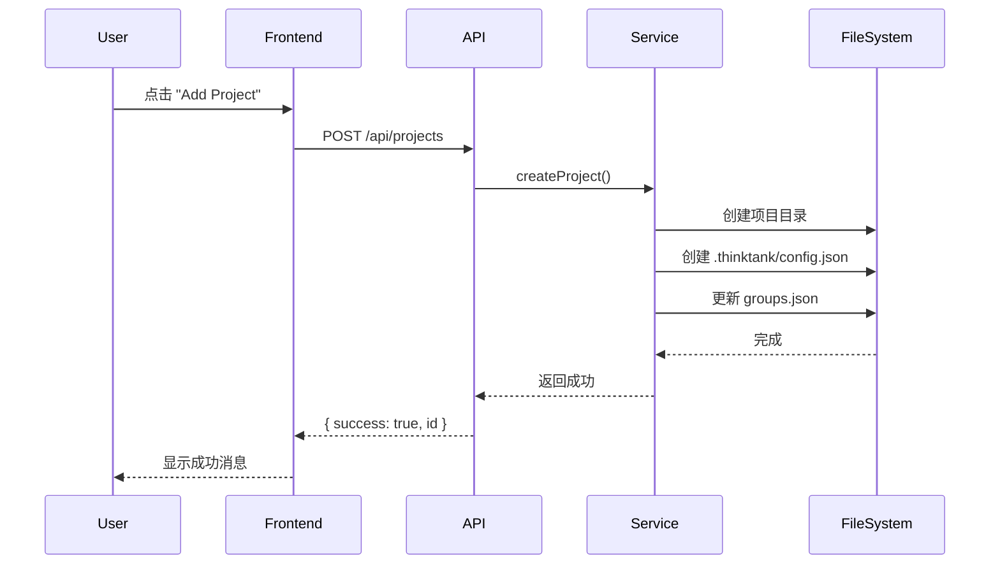
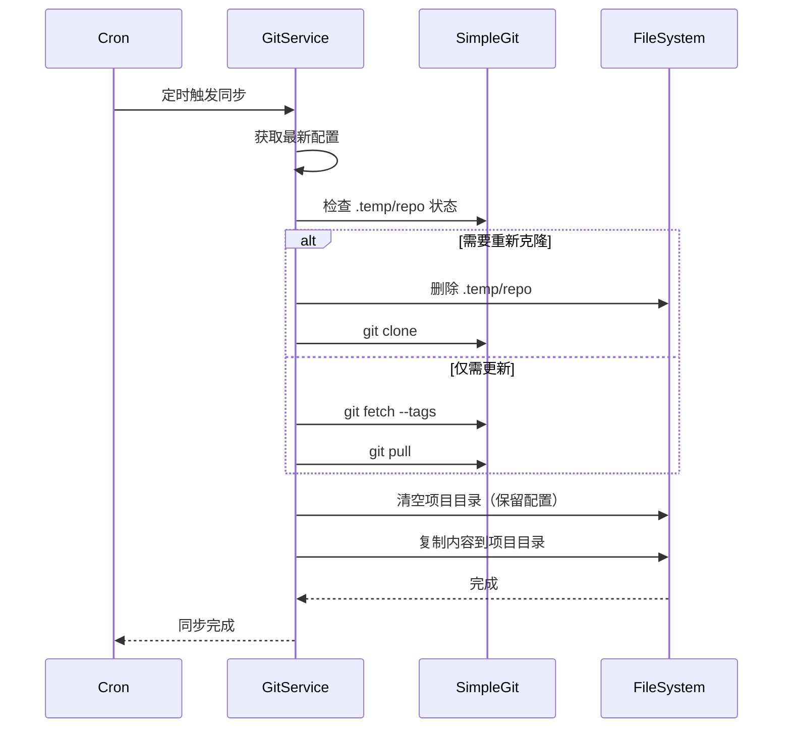
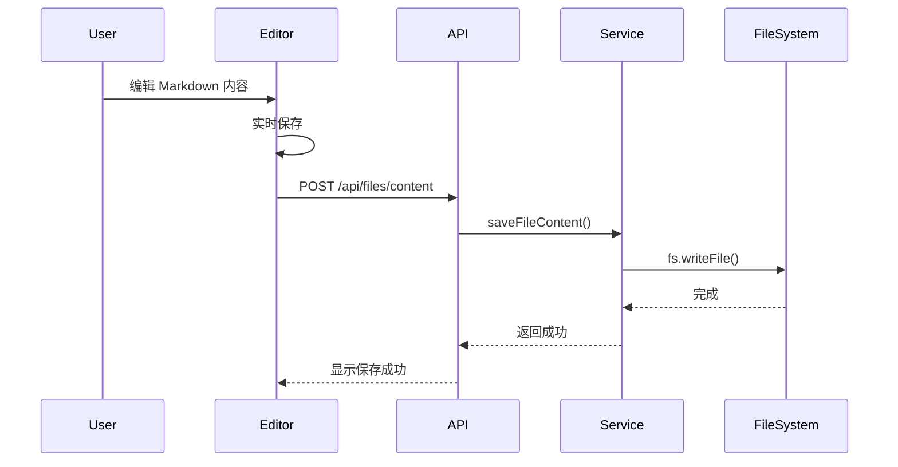

# 系统架构

本文档描述 ThinkTank 的整体架构设计和技术实现。

## 架构图

```
┌────────────────────────────────────────────────────────────────────────────┐
│                         前端层 (Frontend Layer)                       │
│  ┌─────────────────────────────────────────────────────────────────────┐   │
│  │                      Next.js App Router                       │   │
│  │  ┌────────────────┐  ┌────────────────┐  ┌──────────┐  │   │
│  │  │   页面组件   │  │   UI 组件     │  │  Hooks   │  │   │
│  │  │ (pages)      │  │ (shadcn/ui)    │  │ (custom)  │  │   │
│  │  └────────────────┘  └────────────────┘  └──────────┘  │   │
│  └─────────────────────────────────────────────────────────────────────┘   │
└────────────────────────────────────────────────────────────────────────────┘
                              │ API 调用
                              ↓
┌────────────────────────────────────────────────────────────────────────────┐
│                         中间层 (Middleware Layer)                     │
│  ┌─────────────────────────────────────────────────────────────┐       │
│  │                   NextAuth Middleware                      │       │
│  │         - 会话管理 - 权限验证 - 路由保护              │       │
│  └─────────────────────────────────────────────────────────────┘       │
└────────────────────────────────────────────────────────────────────────────┘
                              │ 请求处理
                              ↓
┌────────────────────────────────────────────────────────────────────────────┐
│                        API 层 (API Layer)                         │
│  ┌─────────────┐  ┌─────────────┐  ┌─────────────┐       │
│  │  Project API│  │   File API   │  │   User API  │       │
│  └─────────────┘  └─────────────┘  └─────────────┘       │
│  ┌─────────────┐  ┌─────────────┐  ┌─────────────┐       │
│  │  Group API  │  │  Auth API    │  │  Asset API  │       │
│  └─────────────┘  └─────────────┘  └─────────────┘       │
└────────────────────────────────────────────────────────────────────────────┘
                              │ 服务调用
                              ↓
┌────────────────────────────────────────────────────────────────────────────┐
│                       服务层 (Service Layer)                        │
│  ┌───────────────┐  ┌──────────────┐  ┌──────────────┐     │
│  │  fs-service    │  │  git-sync    │  │  user-service │     │
│  │  文件系统操作   │  │  Git 同步服务  │  │  用户管理服务   │     │
│  └───────────────┘  └──────────────┘  └──────────────┘     │
│  ┌───────────────┐  ┌──────────────┐                       │
│  │  crypto        │  │  config       │                       │
│  │  加密服务      │  │  配置服务      │                       │
│  └───────────────┘  └──────────────┘                       │
└────────────────────────────────────────────────────────────────────────────┘
                              │ 文件 I/O
                              ↓
┌────────────────────────────────────────────────────────────────────────────┐
│                    数据层 (Data Layer)                            │
│  ┌────────────────────────────────────────────────────────────┐           │
│  │                  文件系统 (File System)                  │           │
│  │  - Markdown 文档                                     │           │
│  │  - JSON 配置文件                                  │           │
│  │  - 用户数据文件                                    │           │
│  └────────────────────────────────────────────────────────────┘           │
└────────────────────────────────────────────────────────────────────────────┘
```

## 层级说明

### 1. 前端层 (Frontend Layer)

负责用户界面展示和用户交互。

**主要技术**：
- **Next.js App Router**: 现代化的路由系统，支持服务端组件
- **React Hooks**: 状态管理和副作用处理
- **Tiptap**: Markdown 编辑器
- **shadcn/ui**: 基于 Radix UI 的组件库
- **Tailwind CSS**: 实用优先的样式框架

**关键组件**：
- `Sidebar`: 文件树导航
- `Editor`: Markdown 编辑器
- `HomePage`: 项目仪表盘
- `SearchPalette`: 命令面板

### 2. 中间层 (Middleware Layer)

处理认证和权限验证。

**NextAuth Middleware**：
- 路由保护：`/admin/*` 和 `/project/*` 需要登录
- 会话管理：维护用户登录状态
- 重定向逻辑：未登录用户重定向到 `/login`

配置位置：`middleware.ts`

```typescript
export default withAuth({
  pages: { signIn: "/login" },
});

export const config = {
  matcher: ["/admin/:path*", "/project/:path*"],
};
```

### 3. API 层 (API Layer)

处理 HTTP 请求，执行业务逻辑。

**API 路由结构**：
```
app/api/
├── auth/[...nextauth]/      # NextAuth 配置
├── projects/                 # 项目管理
│   ├── route.ts             # GET (列表), POST (创建)
│   └── [id]/             # 项目详情和设置
│       ├── route.ts         # GET, PUT, DELETE
│       ├── versions/route.ts # Git 版本列表
│       ├── token/route.ts   # Token 验证
│       ├── settings/route.ts # 项目设置更新
│       └── assets/[...path]/route.ts # 资源文件访问
├── files/                    # 文件操作
│   ├── tree/route.ts        # 文件树
│   ├── content/route.ts      # 文件内容
│   ├── create/route.ts       # 创建文件/文件夹
│   ├── rename/route.ts       # 重命名
│   ├── delete/route.ts       # 删除
│   ├── sort/route.ts         # 排序
│   └── visibility/route.ts   # 可见性
├── groups/                   # 分组管理
│   └── route.ts
├── users/                    # 用户管理
│   ├── route.ts             # 用户列表
│   ├── star/route.ts        # 收藏操作
│   └── recent/route.ts      # 最近访问
└── admin/                    # 管理后台
    └── projects/route.ts     # 后台项目列表
```

### 4. 服务层 (Service Layer)

封装核心业务逻辑，可被多个 API 路由复用。

**核心服务**：

| 服务 | 文件 | 职责 |
|-----|------|------|
| `fs-service.ts` | 文件系统操作、项目/文件 CRUD、配置管理 |
| `git-sync-service.ts` | Git 同步、定时任务调度 |
| `user-service.ts` | 用户管理、密码哈希 |
| `crypto.ts` | AES 加密/解密 |
| `config-service.ts` | 配置读取和写入 |

### 5. 数据层 (Data Layer)

唯一的数据源是文件系统。

**存储结构**：
```
docs/
├── .thinktank/                    # 系统级配置
│   ├── groups.json              # 分组定义
│   ├── users.json              # 用户账户（默认用户）
│   └── users/                 # 用户个性化数据
│       └── [userId].json         # { starred: [], recent: [] }
│
└── [project-id]/               # 各项目根目录
    ├── .thinktank/              # 项目级配置
    │   └── config.json          # { description, mode, gitConfig, files, isDeleted }
    ├── *.md                    # Markdown 文档
    ├── *.png/jpg/...          # 资源文件
    └── .temp/                  # Git 模式专用
        └── repo/                # 持久化 Git 仓库
```

## 核心流程

### 项目创建流程



### Git 同步流程



### 文件编辑流程



## 性能优化

### 1. Git 同步优化

- **持久化仓库**：避免每次重新克隆
- **增量更新**：使用 `git pull` 代替 `git clone`
- **自动修复**：检测仓库损坏或 URL 变更后自动重新克隆

### 2. 文件树优化

- **虚拟化渲染**：使用 `react-arborist` 实现虚拟滚动
- **按需加载**：展开时才加载子节点

### 3. 编辑器性能

- **防抖保存**：避免频繁写入磁盘
- **增量更新**：只更新变化的内容

## 下一步

- [数据模型](./data-model.md) - 了解数据结构详情
- [权限体系](./auth-rbac.md) - 了解认证和授权机制
